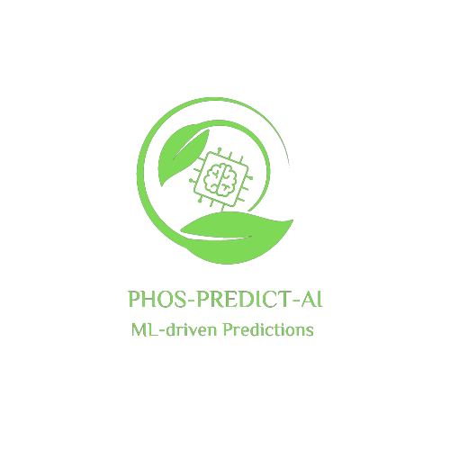
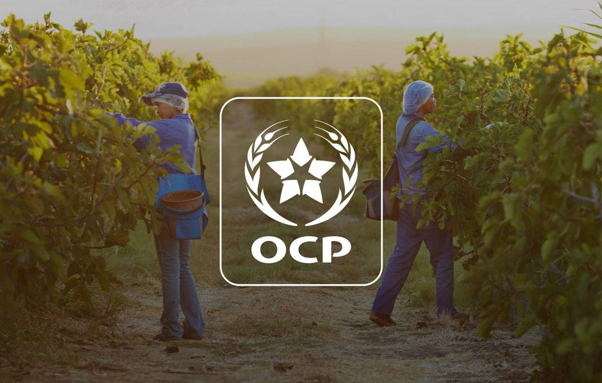

# PhosPridectAI_FV



## Plateforme de Prédiction de Chiffre d'Affaires pour l'Office Chérifien des Phosphates (OCP)



Ce projet vise à développer une plateforme de prédiction du chiffre d'affaires pour l'Office Chérifien des Phosphates (OCP) en utilisant des techniques de Machine Learning. La plateforme inclut une interface web interactive développée avec Flask, permettant aux utilisateurs d'interagir avec les résultats de prédiction.

## Objectifs

L'objectif principal de ce projet est de développer un modèle de prédiction précis pour estimer le chiffre d'affaires futur de l'OCP, basé sur des données historiques. La plateforme permettra aux utilisateurs de :

- Prédire la quantité de phosphate
- Prédire le prix du phosphate
- Visualiser et explorer les prédictions de manière interactive

## Fonctionnalités

1. **Prédiction de Quantité de Phosphate :**
   - Utilisation de modèles de Machine Learning pour prédire la quantité de phosphate produite en fonction des nutriments et d'autres facteurs.

2. **Prédiction de Prix de Phosphate :**
   - Prédiction des prix futurs du phosphate basée sur des variables telles que le prix du diesel, le ratio prix phosphate/diesel, etc.

3. **Interface Web Interactive :**
   - Développée avec Flask, permettant aux utilisateurs de saisir des données, d'obtenir des prédictions et de visualiser les résultats de manière intuitive.

4. **Génération de Rapports PDF :**
   - Fonctionnalité permettant de générer des rapports PDF contenant les prédictions et les données pertinentes.

## Technologies Utilisées

### Backend :

-  **Flask :** Framework web pour la création de l'interface utilisateur.
-  **SQLAlchemy :** ORM pour la gestion des bases de données.
-  **Pickle :** Pour le chargement des modèles de Machine Learning.
-  **Scikit-learn :** Bibliothèque de Machine Learning utilisée pour la construction des modèles.

### Frontend :

- **HTML/CSS :** Pour la création de l'interface utilisateur.
- **Matplotlib & Seaborn :** Pour la visualisation des données.

### Autres Outils :

-  **ReportLab :** Pour la génération de rapports PDF.
- **Pandas :** Pour la manipulation et l'analyse des données.

## Installation

1. **Cloner le dépôt :**
   ```sh
   git clone https://github.com/votre-utilisateur/ocp-prediction-platform.git
   cd ocp-prediction-platform
